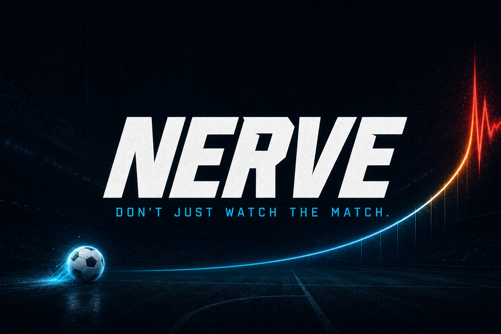

<p align="center">
  
</p>

# NERVE

**NERVE turns watching live football into a shared adrenaline rush, where every attack feels personal and every second tests your nerve.**

**Live demo:** [nerveit.xyz](https://nerveit.xyz) · [Railway](https://nerve-production-3af4.up.railway.app)

<details>
<summary><strong>What it is</strong></summary>

<br>

NERVE is a social game you play alongside a real live football match.

It gives regular football fans the excitement of making live decisions, without needing to understand betting, crypto, or complicated prediction markets.

While the match is happening, your score keeps growing. You can lock it in at any moment, but if a real goal happens first, you lose the round.

The longer you wait, the more points you can earn — and the more intense it becomes.

You can play alone, but NERVE is built to be played with friends. Everyone watches the same match, makes their own decisions, and competes on a shared leaderboard.

It’s a simple way to experience every moment of the match instead of only waiting for the goals.

</details>

<details>
<summary><strong>Description</strong></summary>

<br>

NERVE gives regular sports fans the excitement and tension of real-time prediction without complicated odds, crypto knowledge, or real-money risk.

It turns watching a live match into a simple social experience that anyone can enjoy with friends.

The first version is built for football, but the core mechanic can expand to basketball, tennis, cricket, esports, and other live sports.

</details>

<details>
<summary><strong>Product</strong></summary>

<br>

NERVE is a free-to-play game that runs alongside a real live match.

Players earn virtual points while the game continues and decide when to lock them in. The longer they wait, the more points they can earn. But if a key real-world event happens first, they lose the round.

In football, that event is a goal. In other sports, it could be a basket, point, knockout, wicket, or another major moment.

Players can join private rooms, compete with friends, and react together to every dangerous moment.

NERVE can be embedded directly into sports media, live-score, prediction market, streaming, and betting platforms as an interactive widget.

</details>

<details>
<summary><strong>Business model</strong></summary>

<br>

NERVE helps sports platforms turn passive viewers into active participants and keep them engaged throughout live events.

The product can be monetized through:

- White-label widget integrations
- Sponsored matches and tournaments
- Branded balls, objects, and visual elements
- In-game advertising
- Sponsored rewards and competitions
- Custom branded experiences
- Partner offers and onboarding campaigns

NERVE starts with live football and can scale into a reusable engagement layer for any sport driven by real-time events.

</details>

<details>
<summary><strong>Hackathon submission</strong></summary>

<br>

Built for the **TxODDS × Solana World Cup Hackathon** ($50K prize pool, three tracks: Markets, Trading Agents, Fan Experiences).

- **Track: Fan Experiences** — NERVE is a consumer-facing engagement game, not a trading product: a free-to-play social layer that turns live match data into hold-or-cash-out tension, solo or with friends.
- **Live demo:** [https://nerveit.xyz](https://nerveit.xyz) · [Railway](https://nerve-production-3af4.up.railway.app)
- **TxLINE is the primary data source**, not a decoration — see **How TxLINE powers the game** below and the endpoint-by-endpoint breakdown in [`docs/TECHNICAL.md`](./docs/TECHNICAL.md).
- **Try it in under 10 seconds, zero setup:** open the live demo (or run locally) → **Play as guest** → **Play now**. No wallet, no signup.
- API feedback for TxODDS organizers/judges: [`docs/API-FEEDBACK.md`](./docs/API-FEEDBACK.md).

</details>

<details>
<summary><strong>How to play</strong></summary>

<br>

- Press **HOLD** to stake 100 virtual points when a round is open.
- Watch the multiplier climb. The hotter the danger meter, the faster it grows.
- Press **CASH OUT** before a goal — or get caught when the ball hits the net.

</details>

<details>
<summary><strong>Rooms — play with friends</strong></summary>

<br>

Create a room from the lobby to get a short code, a shareable link, and a QR code. Up to 5 players can join the same room, watch the same match, and see a shared roster + leaderboard — each player holds and cashes out on their own.

</details>

<details>
<summary><strong>How TxLINE powers the game</strong></summary>

<br>

Live mode consumes documented TxLINE Server-Sent Event streams (not WebSockets):

| Endpoint | Role |
| --- | --- |
| `POST /auth/guest/start` | Guest JWT for API calls |
| `GET /api/scores/stream?fixtureId=` | Goals, shots, corners, cards, kickoff / HT / FT |
| `GET /api/odds/stream?fixtureId=` | StablePrice odds → danger meter (`pGoalSoon`) |
| `GET /api/scores/historical/{fixtureId}` | Optional historical backfill (recorder / research) |

Credentials stay on the server. The browser connects to same-origin proxies at `/api/txline/*-stream`. When no live token is configured, **replay mode** (bundled `recordings/demo-match.jsonl`) is the default demo path — judges can play in under 10 seconds with zero setup.

See [`docs/TECHNICAL.md`](./docs/TECHNICAL.md) for architecture and danger-model details.

</details>

<details>
<summary><strong>Virtual points disclaimer</strong></summary>

<br>

**Free to play. Virtual points only. No wagering, no purchases, no payouts.** The Solana wallet is sign-in identity for the leaderboard — no on-chain transactions, no tokens, no NFTs.

</details>

<details>
<summary><strong>Local development</strong></summary>

<br>

```bash
npm install
npm run synthesize          # writes recordings/demo-match.jsonl
cp recordings/demo-match.jsonl public/recordings/
npm run test
npm run dev                 # http://localhost:3000
```

Useful scripts:

```bash
npm run replay:console      # log ReplayStream at 10x
npm run headless            # engine + synthesized match end-to-end
npm run record -- <matchId> # append live TxLINE SSE → recordings/<matchId>.jsonl
```

</details>

<details>
<summary><strong>Environment variables</strong></summary>

<br>

| Variable | Required | Description |
| --- | --- | --- |
| `TXLINE_API_TOKEN` | For live mode | Activated API token from `POST /api/token/activate` (World Cup free tier ok) |
| `TXLINE_API_ORIGIN` | No | Default `https://txline.txodds.com` (use `https://txline-dev.txodds.com` for devnet) |
| `TXLINE_JWT` | No | Guest JWT; refreshed via `/auth/guest/start` if omitted |
| `TXLINE_FIXTURE_ID` | Recommended for live | Fixture filter for odds/scores streams |
| `NEXT_PUBLIC_TXLINE_FIXTURE_ID` | Optional | Same fixture id exposed to the client for the live button |
| `KV_REST_API_URL` / `KV_REST_API_TOKEN` | No | Vercel KV / Upstash — leaderboard; falls back to `localStorage` |

Copy `.env.example` → `.env.local`.

</details>

<details>
<summary><strong>Deploy</strong></summary>

<br>

**Railway** (this repo ships a `Dockerfile` + `railway.json`):

1. Push this repo and import in Railway (or `railway up` from this directory).
2. Set env vars above (live optional — replay works without them).
3. Deploy. Open the URL → **Play as guest** → **Play now**.

**Vercel** works too (no extra config needed):

1. Push this repo and import in Vercel.
2. Set env vars above (live optional — replay works without them).
3. Deploy. Open the URL → **Play as guest** → **Play now**.

</details>

<details>
<summary><strong>Future</strong></summary>

<br>

- Tighter room sync (server-broadcast shared crash clock, not just a shared roster/leaderboard)
- Sponsored matches / branded danger themes
- Premium cosmetic rounds (still virtual points)
- Widget SDK for sports media, prediction, and betting platforms
- Licensed real-stakes version as a **separate, regulated** product — never inside this build

</details>
